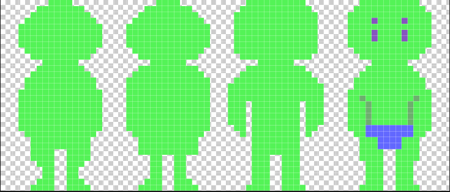

# Estudando pixel art

Comprei um curso de pixel arte e vou documentar aqui neste repositório esse processo. Seguindo os exercicios do curso vou criando as minhas versoes. Esta primeira versão do estudo traz o template basico do personagem na resolução de 8bits, a partir deste template é possivel construir varios personagens! Como na segunda imagem foi feito os olhos, cabelos e roupas

  
  

 
 

Continuando, comecei um novo documento 32x32 que possibilita um nivel melhor de detalhamento do personagem. Na imagem abaixo, foi realizado um exercico de experimentação de silhuetas, onde vamos explorando variações de uma ideia, antes de seguir com o projeto. 

  

