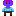

# Estudando pixel art

Esta primeira versão do estudo traz o template basico do personagem na resolução de 8bits, a partir deste template é possivel construir varios personagens! Como na segunda imagem foi feito os olhos, cabelos e roupas

  
  

